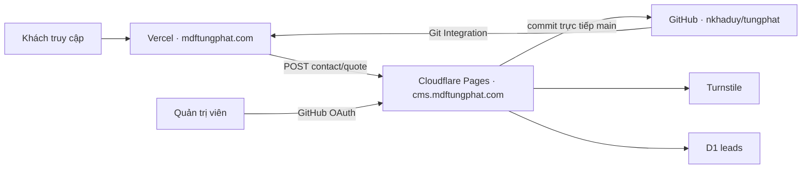

# Kiến trúc hybrid production

## Quyết định

DNS tiếp tục được quản lý tại TenTen; không cần chuyển nameserver.



- Vercel phục vụ website Next.js static export tại apex và `www`.
- Cloudflare Pages project `tungphat-cms` phục vụ Decap CMS, OAuth same-domain,
  Pages Functions và form API.
- GitHub `main` là source of truth cho code, content và ảnh CMS.
- D1 chỉ lưu contact/quote, trạng thái, lịch sử trạng thái và rate limit.
- Canonical luôn là `https://mdftungphat.com`.

## DNS

| Host | Loại | Target | Vai trò |
|---|---|---|---|
| `@` | A | `216.198.79.1` | Website Vercel |
| `www` | CNAME | `d69b5815ccf0cf8d.vercel-dns-017.com` | Website Vercel |
| `cms` | CNAME | `tungphat-cms.pages.dev` | CMS/API Cloudflare |

Không đổi nameserver, apex, `www`, DNSSEC hoặc canonical để vận hành CMS.

## Luồng publish

```text
Decap CMS
→ GitHub OAuth tại cms.mdftungphat.com
→ commit trực tiếp main
→ Vercel Git Integration build/deploy website
```

`publish_mode: simple`; không có editorial workflow hoặc GitHub Actions deploy
website thứ hai.

## Ranh giới bảo mật

- OAuth `/auth` và `/callback` cùng domain CMS, dùng HMAC state 10 phút, cookie
  `Secure`, `HttpOnly`, `SameSite=Lax` và fixed `postMessage` origin.
- Callback chỉ chấp nhận tài khoản GitHub có email đã verify trong allowlist
  server-side; hiện tại là tài khoản quản trị duy nhất.
- Zone Cloudflare của apex chưa active vì nameserver ở TenTen, vì vậy không xem
  Cloudflare Access là security boundary. Pages public nhưng publish bắt buộc
  qua GitHub OAuth và quyền ghi repository.
- Form API production chỉ cho phép origin apex và `www`, không wildcard, không
  credentials.
- Turnstile kiểm tra token, hostname và action server-side. Rate limit dùng hash
  IP có salt; không lưu IP thô và không log PII.

## Dữ liệu và portability

Nội dung Markdown/JSON và ảnh nằm trong Git nên có history và dễ chuyển host.
D1 production `tung-phat-leads` và preview `tung-phat-leads-preview` dùng UUID
khác nhau. Migrations nằm tại `cloudflare-cms/migrations`.

R2 chưa phải dependency. Chỉ đánh giá R2 khi binary trong repository làm
clone/build chậm rõ rệt hoặc cần video lớn.
