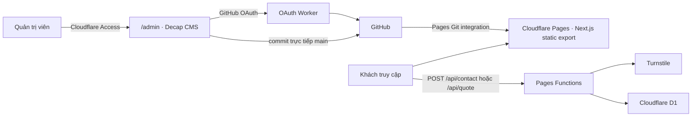

# Kiến trúc production-ready

## Quyết định

Chọn phương án A theo biến thể tối giản:

Nội dung tĩnh và ảnh CMS nằm trong Git. D1 chỉ chứa yêu cầu liên hệ/báo giá và trạng thái xử lý. R2 không phải dependency ở giai đoạn này; `lib/media.ts` là điểm chuyển đổi duy nhất nếu sau này cần custom media domain.

## Vì sao vẫn dùng Pages

Cloudflare hiện khuyến nghị Workers Static Assets cho dự án mới, nhưng repository này đã là static export, Pages Functions và D1 đã hoạt động, không cần SSR/ISR/Server Actions. Pages vẫn có hướng dẫn chính thức cho Next.js static export. Chuyển sang Workers Static Assets lúc này không tạo lợi ích SEO hay vận hành đủ lớn để bù thêm thay đổi routing/form/deploy.

Không dùng OpenNext: mọi route indexable được prerender và `fs` chỉ chạy ở build time. Không có Node API trong Pages Functions.

## So sánh ba phương án

| Tiêu chí | A: Pages + Decap + Access + Worker + D1 | B: Pages + custom admin + Worker + D1 | C: Vercel + CMS/form miễn phí |
|---|---|---|---|
| Chi phí cố định | 0đ trong free tier; domain trả hằng năm | 0đ trong free tier | Không đạt: Vercel Hobby chỉ cho mục đích cá nhân/phi thương mại; website doanh nghiệp cần Pro |
| Độ khó | Trung bình, phần khó nhất là OAuth ban đầu | Cao; phải tự xây editor, media, workflow, auth và bảo trì | Trung bình nhưng có chi phí hosting bắt buộc |
| Chủ cửa hàng sử dụng | Form quản trị có trường draft và publish trực tiếp | Có thể tốt nhưng chỉ sau khi đầu tư nhiều code | Tùy CMS |
| Backup/history | Git commit trên `main` | Phải tự thiết kế hoặc vẫn dùng Git | Phân tán giữa Vercel và CMS |
| SEO/hiệu năng | HTML tĩnh tại edge; nội dung build-time | Tương đương nếu làm đúng | Tương đương, nhưng không còn 0đ hợp lệ |
| Bảo mật | Access bảo vệ UI; GitHub xác thực quyền repo; Worker giữ OAuth secret | Bề mặt tấn công lớn hơn vì auth/editor tự viết | Nhiều vendor và secret hơn |
| Vendor lock-in | Nội dung Markdown/JSON portable; D1 export SQLite SQL | Admin/API tự viết tạo lock-in nội bộ | Cao hơn do nhiều dịch vụ |
| Khôi phục | Rollback Pages + Git revert + D1 export/Time Travel | Phức tạp hơn | Phải phối hợp nhiều dashboard |

## Chi phí và giới hạn

| Hạng mục | Trạng thái | Giới hạn/khả năng phát sinh |
|---|---|---|
| Pages hosting/SSL/CDN | Free tier | 500 build/tháng, 1 build đồng thời, 20.000 file/site, 25 MiB/file |
| Decap CMS | Mã nguồn mở, 0đ | Phụ thuộc GitHub API và quyền push |
| GitHub content/images | GitHub Free | Cảnh báo file >50 MiB, chặn >100 MiB; repo lớn làm clone/build chậm |
| Pages Functions/OAuth Worker | Workers Free | 100.000 request/ngày, 10 ms CPU/invocation; vượt giới hạn Free thì request động thất bại, không tự tính tiền |
| D1 | Free tier | 5 triệu row-read/ngày, 100.000 row-write/ngày, 500 MB/database, 5 GB/account, Time Travel 7 ngày |
| Access | Zero Trust Free | Tối đa 50 người dùng, log chuẩn tối đa khoảng 24 giờ, không có SLA trả phí |
| Turnstile | Free | Phụ thuộc điều khoản/quota hiện hành của Cloudflare |
| Ảnh | Git trong giai đoạn đầu | Script chặn ảnh CMS không phải WebP/AVIF, >2.000 px hoặc >1,5 MiB |
| R2 tương lai | Không dùng hiện tại | Free tier Standard: 10 GB-month, 1 triệu Class A và 10 triệu Class B/tháng; vượt ngưỡng có phí |
| Domain | Không miễn phí | Phí đăng ký/gia hạn hằng năm tùy registrar; không được tính là 0đ |

“0đ/tháng” ở đây nghĩa là không có subscription hạ tầng bắt buộc khi nằm trong free tier. Tên miền vẫn có phí hằng năm; nếu vượt quota phải giảm tải/xóa dữ liệu hoặc chủ động chuyển gói.

## Ranh giới bảo mật CMS

- Access chỉ chặn truy cập `/admin*` ở edge. Access không cấp quyền ghi GitHub.
- Decap dùng GitHub backend. Mỗi quản trị viên vẫn phải đăng nhập GitHub và có quyền push vào repository.
- OAuth Worker công khai `/auth` và `/callback`, giữ client secret, ký state 10 phút và chỉ gửi token về `https://mdftungphat.com`.
- Không đặt Access trước `cms-auth.mdftungphat.com`; callback GitHub phải truy cập được. State/cookie và fixed postMessage origin bảo vệ flow.
- GitHub OAuth scope là `public_repo` cho repo public hoặc `repo` cho repo private; đây là scope rộng do giới hạn của backend. Dùng tài khoản quản trị chuyên biệt, bật 2FA và không dùng các tài khoản đó cho repository không liên quan.

## Ngưỡng cân nhắc R2

Chỉ đánh giá R2 khi repo ảnh tăng tới mức clone/build chậm rõ rệt, tổng binary tiến gần hàng GB, cần video >25 MiB hoặc người quản trị upload thường xuyên. Khi đó giữ content model, mở rộng schema `MediaReference` và đổi resolver tại `lib/media.ts`; không thay toàn bộ component.
